# 🎓 Learner - School Management System

<div align="center">


[](LICENSE)
[](https://github.com/kingz1127/Hackathon-project)
[](https://reactjs.org/)
[](https://nodejs.org/)
[](https://www.mongodb.com/)
[](https://expressjs.com/)

**A comprehensive school management system built collaboratively to streamline education administration**

[Features](#-features) • [Demo](#-demo) • [Installation](#-installation) • [Architecture](#-architecture) • [Contributing](#-contributing)

</div>

---

## 📊 System Overview

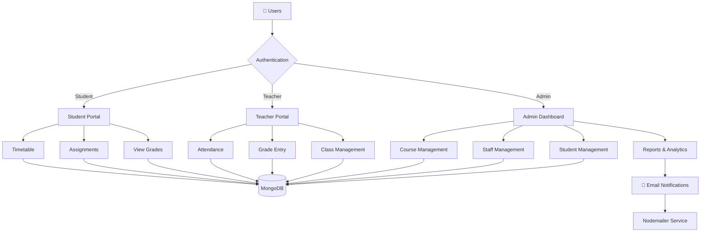

## ✨ Features

### 👨‍💼 For Administrators
```
📈 Dashboard Analytics     → Real-time school performance metrics
👨‍🎓 Student Management     → Complete enrollment and academic tracking
👨‍🏫 Staff Management       → Teacher profiles and performance monitoring
📚 Course Management       → Curriculum creation and subject management
✅ Attendance Tracking     → Comprehensive attendance reports
💰 Fee Management          → Payment tracking and invoice generation
```

### 👨‍🏫 For Teachers
```
🏫 Class Management        → View assigned classes and rosters
📝 Grade Entry             → Record and update assessments
📋 Attendance Marking      → Quick attendance submission
📤 Assignment Distribution → Create and share coursework
💬 Communication Hub       → Direct messaging with students/parents
```

### 👨‍🎓 For Students
```
📊 Academic Dashboard      → View grades and attendance
📥 Assignment Tracking     → Access and submit assignments
🗓️ Timetable View          → Personal class schedule
📈 Progress Reports        → Track academic performance
🔔 Notifications           → Important announcements and updates
```

## 🏗️ Architecture

### System Architecture Diagram

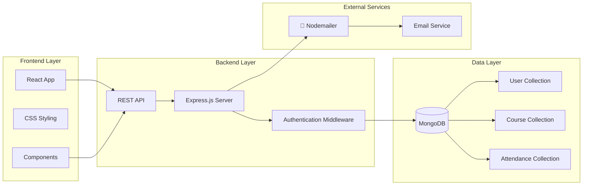

### Data Flow Architecture

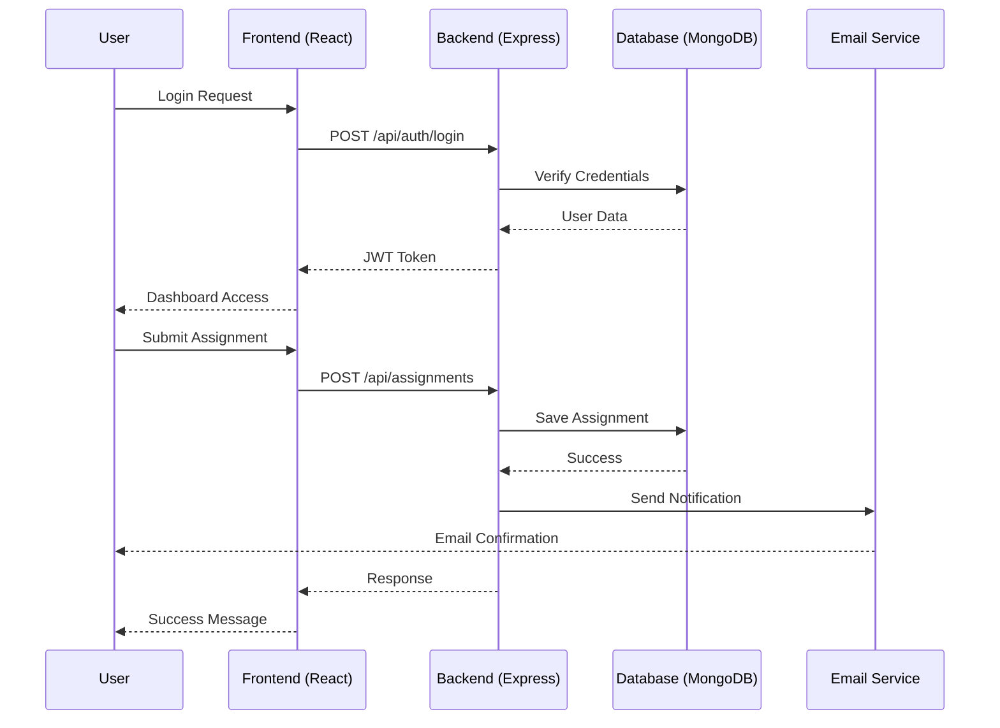

## 🛠️ Tech Stack

<div align="center">

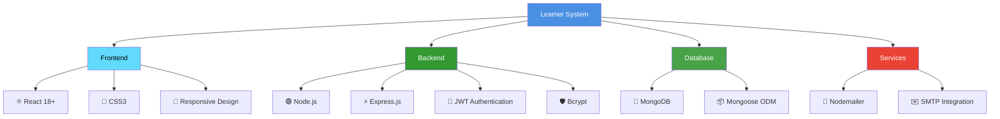

</div>

## 🚀 Getting Started

### Prerequisites

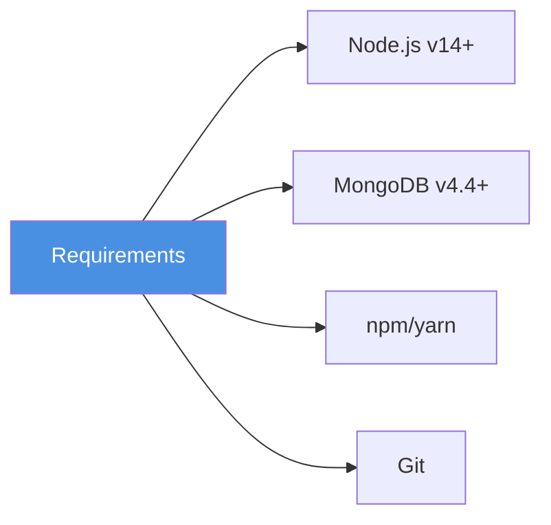

### Installation

**1. Clone the repository**
```bash
git clone https://github.com/kingz1127/Hackathon-project.git
cd Hackathon-project
```

**2. Install backend dependencies**
```bash
cd backend
npm install
```

**3. Install frontend dependencies**
```bash
cd ../frontend
npm install
```

**4. Configure environment variables**

Create a `.env` file in the backend directory:
```env
PORT=5000
MONGODB_URI=mongodb://localhost:27017/learner
JWT_SECRET=your_super_secret_jwt_key_here
JWT_EXPIRE=7d

# Email Configuration
EMAIL_HOST=smtp.gmail.com
EMAIL_PORT=587
EMAIL_USER=your_email@gmail.com
EMAIL_PASS=your_app_specific_password

# Frontend URL
CLIENT_URL=http://localhost:3000
```

**5. Database Setup**
```bash
# Start MongoDB service
mongod

# In a new terminal, seed the database (optional)
cd backend
npm run seed
```

**6. Run the application**

```bash
# Terminal 1 - Backend
cd backend
npm run dev

# Terminal 2 - Frontend
cd frontend
npm start
```

🎉 **Application running at:** `http://localhost:3000`

## 📁 Project Structure

```
Hackathon-project/
│
├── 📂 frontend/
│   ├── 📂 public/
│   │   ├── index.html
│   │   └── favicon.ico
│   ├── 📂 src/
│   │   ├── 📂 components/
│   │   │   ├── Admin/
│   │   │   ├── Teacher/
│   │   │   ├── Student/
│   │   │   └── Shared/
│   │   ├── 📂 pages/
│   │   │   ├── Dashboard.js
│   │   │   ├── Login.js
│   │   │   └── Register.js
│   │   ├── 📂 styles/
│   │   │   ├── global.css
│   │   │   └── components.css
│   │   ├── 📂 utils/
│   │   │   ├── api.js
│   │   │   └── helpers.js
│   │   ├── App.js
│   │   └── index.js
│   └── package.json
│
├── 📂 backend/
│   ├── 📂 config/
│   │   ├── db.js
│   │   └── email.js
│   ├── 📂 controllers/
│   │   ├── authController.js
│   │   ├── studentController.js
│   │   └── teacherController.js
│   ├── 📂 models/
│   │   ├── User.js
│   │   ├── Course.js
│   │   ├── Assignment.js
│   │   └── Attendance.js
│   ├── 📂 routes/
│   │   ├── authRoutes.js
│   │   ├── studentRoutes.js
│   │   └── teacherRoutes.js
│   ├── 📂 middleware/
│   │   ├── auth.js
│   │   ├── errorHandler.js
│   │   └── validation.js
│   ├── 📂 utils/
│   │   ├── emailService.js
│   │   └── tokenGenerator.js
│   ├── server.js
│   └── package.json
│
├── 📄 README.md
├── 📄 .gitignore
└── 📄 LICENSE
```

## 🔐 Authentication Flow

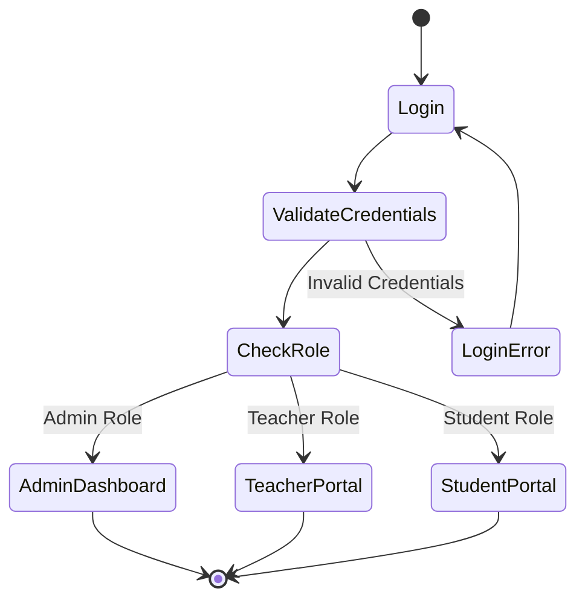

## 📧 Email Notification System

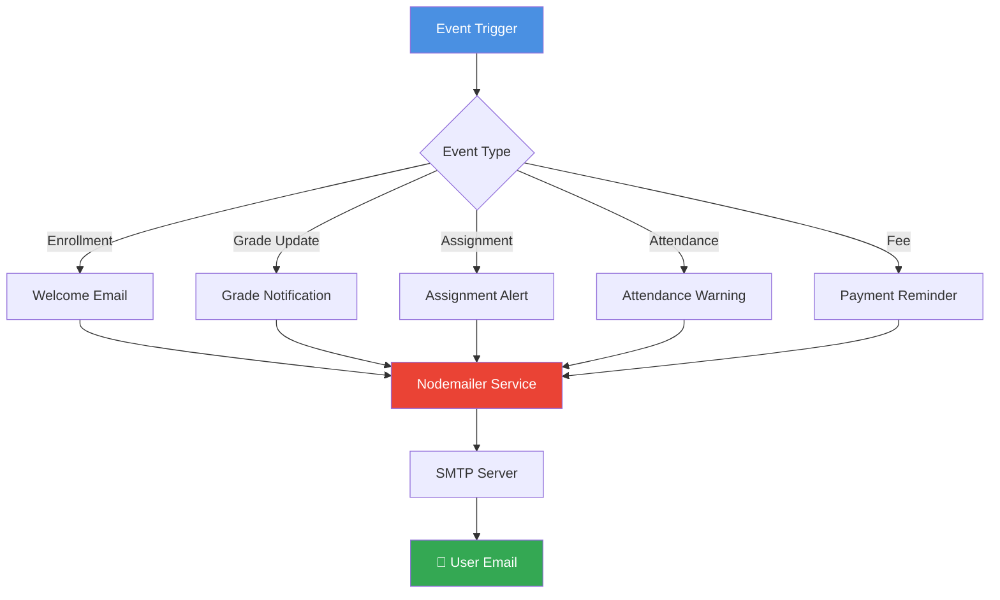

### Automated Emails Include:
- ✅ New student enrollment confirmations
- 📊 Grade updates and report cards
- 📝 Assignment due date reminders
- ⚠️ Attendance alerts
- 💰 Fee payment reminders
- 📢 System announcements

## 🔒 Security Features

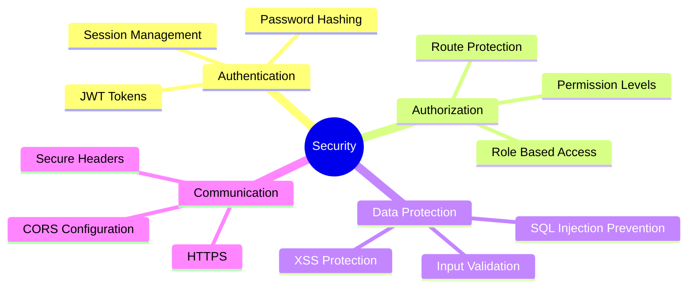

- 🔐 **JWT Authentication** - Secure token-based authentication
- 🔒 **Password Encryption** - Bcrypt hashing for passwords
- 👥 **Role-Based Access Control** - Admin, Teacher, Student roles
- ✅ **Input Validation** - Server-side validation and sanitization
- 🛡️ **Secure Headers** - Protection against common vulnerabilities

## 📊 Database Schema

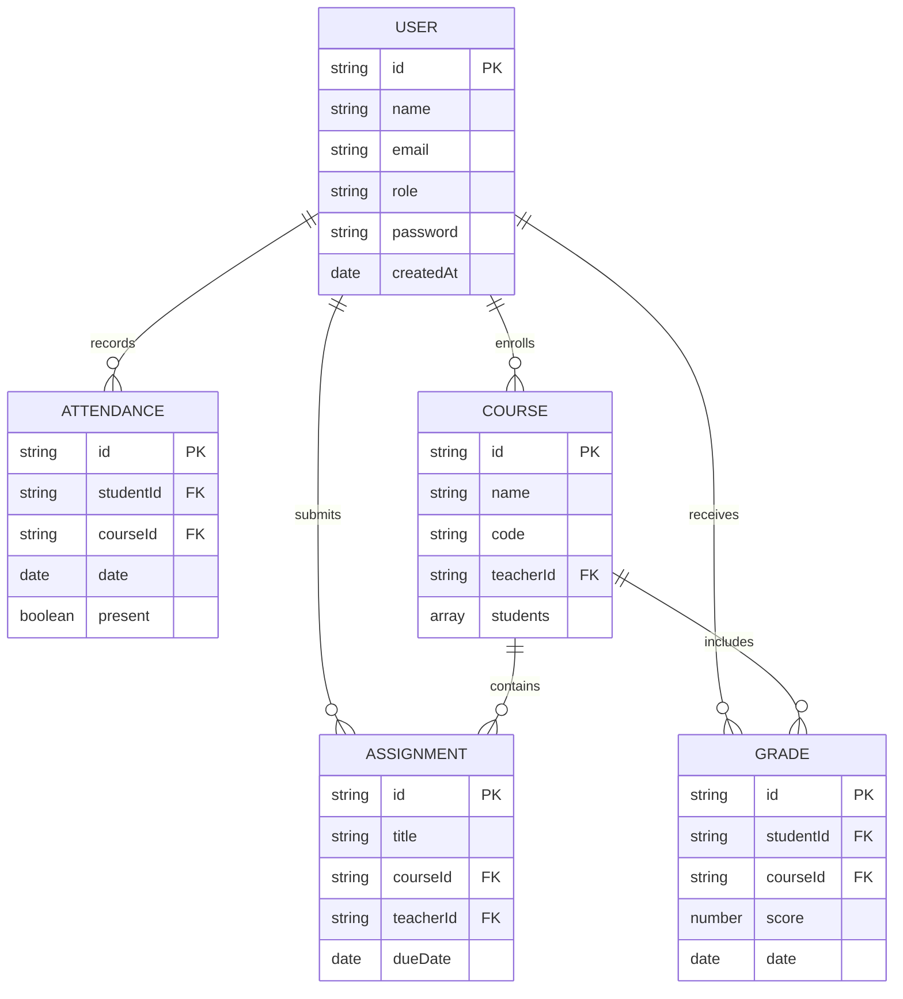

## 👥 Team & Contributors

This project is a **collaborative effort** built during a hackathon. We believe in the power of teamwork and open-source contribution!

### 🌟 Core Contributors

<div align="center">

| Role | Contribution |
|------|-------------|
| 🎨 **Frontend Developers** | React components, UI/UX design, responsive layouts |
| ⚙️ **Backend Developers** | API development, database design, authentication |
| 🗄️ **Database Architects** | MongoDB schema, data modeling, optimization |
| 📧 **Integration Specialists** | Nodemailer setup, email templates, notifications |

</div>

### How to Contribute

We welcome contributions from everyone! Here's how you can help:

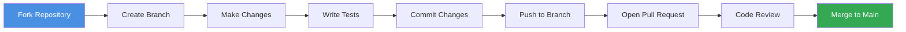

**Step-by-step:**

1. 🍴 **Fork** the repository
2. 🌿 **Create** a feature branch (`git checkout -b feature/AmazingFeature`)
3. ✏️ **Commit** your changes (`git commit -m 'Add some AmazingFeature'`)
4. 📤 **Push** to the branch (`git push origin feature/AmazingFeature`)
5. 🎯 **Open** a Pull Request

### Contribution Guidelines

- Follow the existing code style
- Write meaningful commit messages
- Add tests for new features
- Update documentation as needed
- Be respectful and collaborative

## 🧪 Testing

```bash
# Run backend tests
cd backend
npm test

# Run frontend tests
cd frontend
npm test

# Run coverage report
npm run test:coverage
```

## 📱 Demo

### Screenshots

<div align="center">

| Admin Dashboard | Teacher Portal | Student View |
|:---------------:|:--------------:|:------------:|
|  |  |  |

</div>

## 🚀 Deployment

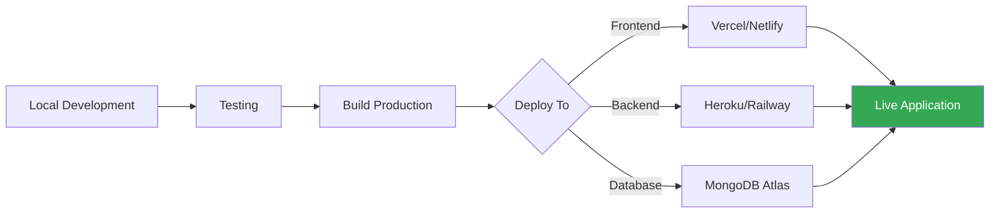

### Deployment Options

- **Frontend:** Vercel, Netlify, GitHub Pages
- **Backend:** Heroku, Railway, DigitalOcean
- **Database:** MongoDB Atlas, AWS DocumentDB

## 🤝 Support

Need help? We're here for you!

- 🐛 **Issues:** [GitHub Issues](https://github.com/kingz1127/Hackathon-project/issues)
- 📚 **Documentation:** [Wiki](https://github.com/kingz1127/Hackathon-project/wiki)

## 🙏 Acknowledgments

- 💡 Built with passion during a hackathon
- 🌟 Inspired by the need for better education management
- 👏 Thanks to all contributors and supporters
- 📚 Special thanks to the open-source community

## 📈 Project Stats

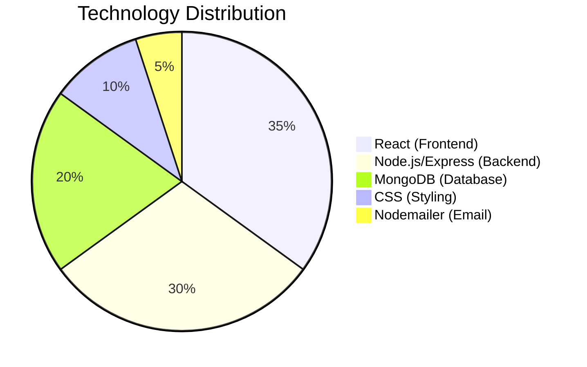

---

<div align="center">

**Made with ❤️ by the Learner Team**

⭐ **Star us on GitHub** — it helps!

[Report Bug](https://github.com/kingz1127/Hackathon-project/issues) • [Request Feature](https://github.com/kingz1127/Hackathon-project/issues) • [Documentation](https://github.com/kingz1127/Hackathon-project/wiki)

</div>
