# 🎓 Learner — School Management System

> A modern full‑stack **school management system** designed for administrators, teachers, parents, and students. Built for scalability, automation, and smooth learning workflow.


---

## 🧱 System Architecture

```mermaid
graph TB
    subgraph FE[💻 Frontend Layer]
        UI[React Interface]
        CSS[Custom CSS Styling]
        AX[Axios API Calls]
        AUTH[Email Auth]
        ICONS[react-icons & lucide-react]
        COUNTRY[react-countrylist]
    end

    subgraph BE[⚙️ Backend Layer]
        Server[Node.js + Express]
        Router[API Routes]
        Middleware[Auth & Rate Limit]
        Uploads[Multer File Upload]
        Mailer[Nodemailer]
    end

    subgraph DB[(💾 MongoDB Database)]
        Users[Users]
        Teachers[Teachers]
        Students[Students]
        Classes[Classes]
        Subjects[Subjects]
        Results[Results]
    end

    FE -->|HTTP/API| BE
    BE --> DB
    BE --> Mailer
    BE --> Uploads

    style FE fill:#e3f2fd
    style BE fill:#fff3e0
    style DB fill:#e8f5e9
```

---

## 🔄 User Journey Flow

```mermaid
graph LR
    A[👤 User Opens Learner App] --> B{Authenticated?}
    B -->|❌ No| C[📩 Login or Register]
    B -->|✔️ Yes| D[🏫 Dashboard]

    C --> D

    D --> E[📚 Manage Classes]
    D --> F[👨‍🏫 Teacher Portal]
    D --> G[🎒 Student Portal]
    D --> H[📊 View Results]
    D --> I[🔔 Notifications]

    E --> E1[Add / Edit Classes]
    F --> F1[Mark Attendance]
    G --> G1[View Assignments]
    H --> H1[Download Report Cards]

    style A fill:#bbdefb
    style C fill:#ffe0b2
    style D fill:#c8e6c9
    style E1 fill:#fff9c4
```



---

## 📊 API Data Flow

```mermaid
sequenceDiagram
    autonumber
    participant U as 👤 User
    participant F as 🖥️ Frontend
    participant B as ⚙️ Backend
    participant D as 💾 MongoDB
    participant M as 📬 Nodemailer

    U->>F: Login with Email
    F->>B: POST /auth/login
    B->>D: Find User
    D-->>B: User Data
    B-->>F: JWT Token + Profile
    F-->>U: Redirect to Dashboard

    U->>F: Upload Assignment
    F->>B: POST /upload + Token
    B->>B: Multer Save File
    B->>D: Save Metadata
    D-->>B: OK
    B-->>F: Success

    U->>F: Request Password Reset
    F->>B: POST /auth/forgot
    B->>M: Send Reset Email
    M-->>U: Reset Link
```



---

## 🗄️ Database Schema

```mermaid
erDiagram
    USER ||--o{ STUDENT : manages
    USER ||--o{ TEACHER : manages

    USER {
        ObjectId _id PK
        string name
        string email UK
        string role
        string passwordHash
        date createdAt
    }

    STUDENT {
        ObjectId _id PK
        string name
        string classId
        string guardianEmail
        array results
        date joinedAt
    }

    TEACHER {
        ObjectId _id PK
        string name
        array subjects
        array classesAssigned
    }

    CLASS {
        ObjectId _id PK
        string name
        array students
        array subjects
    }

    SUBJECT {
        ObjectId _id PK
        string name
        string teacherId
        array topics
    }
```

---

## 🚀 Quick Start

```mermaid
graph TD
    Start([🚀 Start Setup]) --> Clone[📥 Clone Repository]
    Clone --> Backend[⚙️ Setup Backend]
    Clone --> Frontend[💻 Setup Frontend]

    Backend --> B1[npm install]
    B1 --> B2[Configure .env]
    B2 --> B3[npm run dev]

    Frontend --> F1[npm install]
    F1 --> F2[Setup API URL]
    F2 --> F3[npm run dev]

    B3 --> Ready
    F3 --> Ready

    Ready([🎉 App Ready])
```



---

## 🔌 API Routes Map

```mermaid
graph LR
    subgraph Public
        P1[POST /auth/login]
        P2[POST /auth/register]
        P3[POST /auth/forgot]
    end

    subgraph Protected
        PR1[GET /students]
        PR2[POST /classes/create]
        PR3[POST /assignments/upload]
        PR4[GET /teachers]
        PR5[POST /results/add]
    end

    JWT{🔐 JWT Auth} --> Protected

    style Public fill:#c8e6c9
    style Protected fill:#ffccbc
```



---

## 🛠️ Tech Stack Breakdown


---

## 📦 Environment Variables


---

## 📞 Support & Contact

* ✉️ Email: [support@learner.school](mailto:support@learner.school)
* 🐛 Issues: github.com/learner/issues
* 👤 Developer: Paul Thanksgiving

---

## 📄 License

MIT © 2024 Learner School Management System

<div align="center"><b>Made with ❤️ using MERN</b></div>
